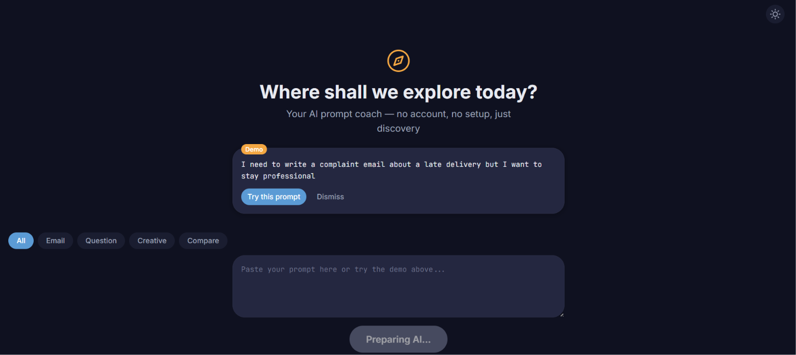

# Prompt Engineer

> **⚠️ Status: Early development.** The scaffold, welcome screen (Story 1.1), and
> local LLM integration with async model download (Story 1.2) are built. Most
> features below are not implemented yet. See the roadmap.

A local, offline desktop app for practicing prompt engineering — built with
**Tauri v2**, **React 18**, and **TypeScript**, no account required.

This is a portfolio project built spec-first: requirements, architecture, and
stories are written as artifacts *before* implementation, using the **BMAD**
method (Breakthrough Method for Agile AI-Driven Development). The full planning
set is public under [`_bmad-output/`](./_bmad-output) — the process is meant to
be as auditable as the code.

## The idea
Most people use AI like a basic chatbot. Prompt Engineer is designed to close
that gap by being both tool and tutor: refine a prompt, see *why* the change
works, and practice deliberately. Planned capabilities:

- **Fast Refine** — instant local-LLM prompt improvement, fully offline.
- **Master Mode** — a short coaching dialog (cloud LLM) that sharpens intent.
- **Prompt Dissector** — color-coded breakdown of prompt anatomy (role, task, format, context).
- **LLM Adapter Preview** — the same prompt formatted for Claude, GPT, and Gemini, side by side.
- **Skill Tree** — gamified progression with quests and streaks.

## Status & roadmap
**Built:** Tauri v2 + React 18 + Vite + TypeScript scaffold, Tailwind v4 design
tokens, Zustand stores, theme toggle, welcome screen, test setup (Vitest + RTL).



**Next:** Fast Refine engine → Prompt Dissector → application shell.

**Backlog:** Master Mode, application shell, LLM adapters, gamification,
NLP domain detection, distribution.

Full epic/story breakdown: [`_bmad-output/planning-artifacts/epics.md`](./_bmad-output/planning-artifacts/epics.md).

## Tech stack
| Layer     | Now                                  | Planned                          |
| --------- | ------------------------------------ | -------------------------------- |
| Desktop   | Tauri v2 (Rust backend + WebView)    | —                                |
| Frontend  | React 18, TypeScript (strict), Vite  | —                                |
| Styling   | Tailwind v4, Framer Motion           | —                                |
| State     | Zustand                              | —                                |
| Testing   | Vitest + React Testing Library       | cargo test (Rust)                |
| Local LLM | llama-cpp-rs, Llama 3.2 1B          | —                                |
| NLP       | —                                    | Python sidecar (spaCy), JSON-RPC |
| Storage   | —                                    | SQLite, OS keychain (stronghold) |
| CI/CD     | —                                    | GitHub Actions, auto-update      |

**Target platforms:** Windows 10+, macOS 12+, Ubuntu 22.04+.

## Getting started (dev)
Requires Node 20+, pnpm 9+, Rust 1.77+ (plus a C++ compiler + CMake once the
local-LLM work lands).

```bash
git clone https://github.com/777marvin/prompt-engineer.git
cd prompt-engineer
pnpm install
pnpm tauri dev
```

Common commands: `pnpm dev` (UI only) · `pnpm test` (Vitest) · `pnpm lint` ·
`cargo test` / `cargo clippy` (from `src-tauri/`).

## Contributing
See [`CONTRIBUTING.md`](./CONTRIBUTING.md). Commits follow
[Conventional Commits](https://www.conventionalcommits.org/)
(`feat:`, `fix:`, `refactor:`, `test:`, `docs:`, `chore:`).

## License
MIT — see [LICENSE](./LICENSE).