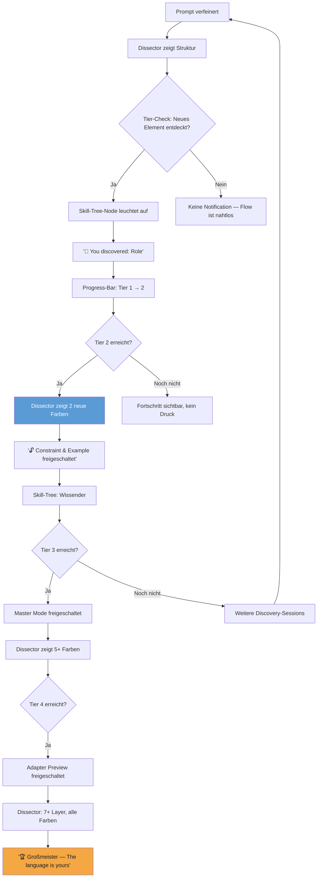

# UX Design Specification — Prompt Engineer

**Author:** Marvin
**Date:** 2026-06-27

---

## Executive Summary

### Project Vision

Prompt Engineer is a local desktop application that teaches non-technical users the "language of AI" through active, guided practice — not passive tutorials. It unifies prompt refinement (the *how*) with visual didactics (the *why*) in a single, zero-configuration experience. Unlike prompt marketplaces or video tutorials, Prompt Engineer meets users at their level and grows with them — from first prompt to mastery — using a local LLM, a dialogic coaching mode, color-coded prompt dissection, and a skill-tree-based progression system.

### Target Users

**Primary — Non-Technical Users:**
- Sandra (30, horse stable worker): Uses AI regularly but naively. Wants to understand *why* prompts work.
- Klaus (58, retiree): Skeptical, needs the lowest possible entry barrier.
- Broad base: Students, teachers, homemakers, craftspeople — all sharing the gap between using AI and understanding it.

**Secondary — Power Users & Contributors:**
- Marvin (tech-savvy): Uses the tool as a polishing and experimentation platform. Becomes a multiplier who recommends it to non-tech users.
- Lena (developer): Open-source contributor drawn by the Rust/Tauri/LLM stack.

### Key Design Challenges

1. **Zero-Onboarding / Power-User Paradox** — One UI must feel effortless for Sandra and deep for Marvin, without compromising either.
2. **Integrated Didactics** — The Prompt Dissector must teach *within* the workflow, not as a separate tutorial overlay.
3. **Gamification Maturity** — Skill Trees and quests must motivate adults without feeling childish or patronizing.
4. **Adaptive Complexity** — The Learning Dissector scales from 2 colors (Tier 1) to 7+ layers (Tier 4) — revealing complexity at the right pace.
5. **Coaching-Style Conversation** — The Master Mode dialog must feel like talking to a coach, not filling out a form.

### Design Opportunities

1. **Visual Prompt Dissection** — Color-coded structural deconstruction makes prompt engineering *visible*, not just readable.
2. **Adaptive UI as Growth Companion** — The interface grows with the user, borrowing skill-tree patterns from gaming.
3. **Cross-LLM Transparency** — A three-column live adapter preview makes LLM differences tangible for the first time.
4. **Progressive Disclosure Architecture** — Features unlock through tiers, contextual hints, and an invisible command-palette power-user layer.

## Core User Experience

### Defining Experience

The core interaction loop of Prompt Engineer is **Fast Refine + Prompt Dissector** — a single, seamless flow where users input raw text, receive a structured prompt in under 500ms, and immediately see a color-coded visual breakdown of *why* the prompt works. This dual-action loop (improve + understand) is repeated across every session and every user type. It is the backbone — the Fast Refine delivers instant gratification, while the Prompt Dissector delivers lasting understanding. All other features (Master Mode coaching, Adapter comparison, Skill-Tree progression) extend and deepen this core loop.

### Platform Strategy

| Dimension | Decision |
|-----------|----------|
| **Application Type** | Cross-platform desktop via Tauri (Rust backend + React/WebView frontend) |
| **Target OS** | Windows 10+ (Tier 1), macOS 12+ (Tier 1), Ubuntu 22.04+ Linux via AppImage (Tier 2) |
| **Primary Input** | Mouse and keyboard (no touch-first design) |
| **Offline Core** | Fast Refine, Prompt Dissector, Before/After Diff, and Skill-Tree display fully offline |
| **Online Features** | Master Mode, Live Adapter Preview, optional NLP cloud fallback |
| **System Integration** | OS-native credential storage, Tauri built-in updater, native window chrome |
| **Power-User Layer** | Keyboard shortcuts, Command Palette (Ctrl+Shift+P), progressive feature disclosure |

### Effortless Interactions

1. **Zero-Onboarding Launch** — App opens directly into a working interface with a demo prompt visible. The local LLM model downloads asynchronously in the background with progress indication. No account, no API key, no configuration required.
2. **Instant Refinement** — Fast Refine delivers a structured, clearer prompt in <500ms with a single click. No loading spinner, no text streaming delay.
3. **Automatic Domain Detection** — The NLP engine identifies whether the input is an email, comparison, research query, or creative request — no manual dropdown, no user decision required.
4. **One-Click Copy** — The refined prompt is copyable to clipboard in a single action for immediate use in external LLM tools.
5. **Seamless Mode Switching** — Fast Refine ↔ Master Mode toggle preserves input context; no data loss, no re-entry.

### Critical Success Moments

| Moment | Why It Determines Success |
|--------|---------------------------|
| **First Refined Prompt (T<60s)** | The user opens the app and produces their first improved prompt within 60 seconds. If this fails, retention collapses. |
| **First Dissector View** | The user sees their prompt color-coded into structural components (Role, Task, Format, Context). This is the didactic breakthrough — the moment understanding begins. |
| **Before/After Diff** | The side-by-side comparison reveals concrete, line-level improvements. If the difference is not visually obvious, perceived value evaporates. |
| **First Skill-Tree Advancement** | The user progresses from Discoverer (Tier 1) to Knower (Tier 2). Progression becomes tangible and motivating. |
| **First Master Mode Dialog** | The user experiences a natural, coaching-style conversation that produces a meaningfully deeper prompt — proving the tool has depth beyond Fast Refine. |
| **"I used AI like an ape before" Realization** | The qualitative breakthrough moment where the user understands their own growth. This is the ultimate validation signal. |

### Experience Principles

1. **Meet Users Where They Are** — Zero prerequisites, zero configuration. The app explains without patronizing, guides without lecturing. Every user, from Sandra to Klaus to Marvin, feels respected at their current level.

2. **Teach by Doing** — Didactics are embedded in the workflow, not separated into tutorials. The Prompt Dissector teaches *in the moment of use*. Understanding emerges from action, not from passive consumption.

3. **Reveal Complexity Progressively** — The UI grows with the user. Tier 1 sees 2 colors in the Dissector; Tier 4 sees 7+ structural layers. Features unlock through tiers, contextual hints, and the invisible Command Palette. Nothing is forced; everything is discoverable.

4. **Reward with Substance, Not Points** — Gamification serves learning (Skill-Tree = demonstrated competence), not collecting (no badges, no meaningless levels). Progress means the user has genuinely grown — and can feel it.

5. **Deliver Instant Gratification, Build Lasting Depth** — Fast Refine in <500ms for immediate satisfaction. Master Mode, Adapter comparison, and Skill-Tree progression for long-term engagement. The tool gives both: the quick win and the deep reward.

## Desired Emotional Response

### Primary Emotional Goals

Prompt Engineer's core emotional goal is **discovery joy — the language of AI as a new land to explore.** Users are not students forced to learn; they are explorers equipped with a compass. Every refined prompt is a small expedition. The Prompt Dissector is the map that makes the terrain readable. The emotional arc is not "I must learn this" but "Look what I can discover." This culminates in the user's own realization: *"I used AI like an ape before"* — a moment not of shame, but of amazed self-awareness.

### Emotional Journey Mapping

| Phase | Emotion | Trigger |
|-------|---------|---------|
| **First Contact** | Curiosity, not overwhelm | App opens to a working demo prompt; no setup, no blank canvas intimidating the user |
| **First Interaction** | Wonder, not confusion | Fast Refine returns a visibly improved prompt in <500ms — "Wow, it made *that* out of my text?" |
| **First Dissector View** | **Aha! — the discovery** | Color-coded structural components reveal *why* the prompt works. The user sees the language for the first time |
| **Recurring Use** | Familiarity + renewed curiosity | Each session is a mini-expedition; the Skill Tree shows there is more to uncover |
| **Deep Exploration** | Competence + playful experimentation | Master Mode coaching, Adapter comparison — "What happens when I try this with Claude?" |
| **Mastery** | Pride + independence | "I barely need the tool anymore — but I still discover new things." |

### Micro-Emotions

| Emotional Pair | Target Emotion | Rationale |
|---------------|----------------|-----------|
| **Trust vs. Skepticism** | Trust | Sandra must feel the tool explains honestly, not magically. The model download progress bar builds transparency, not black-box mystery |
| **Discovery vs. Overwhelm** | Discovery | Klaus explores at his own pace. Progressive disclosure prevents "too much at once" |
| **Pride vs. Frustration** | Pride | The Skill Tree celebrates genuine growth, not empty points. Achievement is real competence |
| **Curiosity vs. Fear** | Curiosity | The demo prompt invites: "Try it." No blank canvas that intimidates |
| **Belonging vs. Isolation** | Belonging | "I am not the only one who used AI wrong before." The tone is inclusive, never elitist |

### Design Implications

| Emotion | UX Design Decision |
|---------|--------------------|
| **Discovery joy** | No right/wrong framing. The Prompt Dissector shows structure, not errors. The stance is: "Look what's happening here" — never "You did this wrong." |
| **Wonder** | Before/After Diff must dramatize the contrast visibly. Not a developer-grade diff tool, but a clear before/after reveal that makes improvement unmistakable |
| **Aha! moment** | The Dissector must be understood instantly on first view. Beyond color-coding: a brief animated overlay introducing each component — "🟦 This is your role, 🟩 this is your task…" |
| **Trust** | Progress bars, clear communication of offline/online status, no hiding of technology. Transparency builds confidence |
| **Pride** | Skill Tree progress visible but unobtrusive. Small moments: "You discovered your 10th prompt today" |

### Emotional Design Principles

1. **Invite Exploration, Never Assign Homework** — Every feature is framed as something to discover, not something the user must learn. The demo prompt is a trailhead, not a lesson plan.

2. **Show, Don't Shame** — The Dissector reveals structure; it never marks errors. Users grow by seeing what works, not by being told what they did wrong.

3. **Reward the Explorer** — Every interaction can yield a small discovery. The Skill Tree tracks genuine exploration, not checkbox completion.

4. **Make the Invisible Visible** — The Before/After Diff and Adapter comparison render abstract improvements concrete. Users see their own progress as they see their prompts transform.

5. **Keep the Door Open** — The user never feels trapped or committed. Mode switching is seamless, prompts are always recoverable, and the tool invites return visits through progressive disclosure of depth.

## UX Pattern Analysis & Inspiration

### Inspiring Products Analysis

#### Spotify — Discovery Experience

| UX Success Factor | What Spotify Gets Right | Relevance for Prompt Engineer |
|-------------------|------------------------|-------------------------------|
| **No blank canvas** | On open: "Made for You", recommendations, recently played. The user never asks "What do I do now?" | Demo prompt visible at launch; never an empty text field |
| **Discovery Weekly** | Fresh, personally curated discoveries every week. Present but not pushy | Prompt Inspiration Feed (v2.0) — periodic fresh blueprints, adaptive |
| **Progressive exploration** | From simple Play to playlists, radio, podcasts, social. Depth exists but is never forced | Fast Refine (simple) → Dissector (discover) → Master Mode (deeper) → Adapters (experimental) |
| **Visual cover art as identity** | Album art makes music tangible. Every song has a visual face | Color-coded prompt components as the visual identity of each prompt |
| **"Like" as lightest feedback** | One click, no justification needed. Lowest barrier to interaction | "Copy prompt" as the lightest interaction — one click, done |

#### Learning Apps with Didactics/Progression (Duolingo-style)

| UX Success Factor | What Learning Apps Get Right | Relevance for Prompt Engineer |
|-------------------|------------------------------|-------------------------------|
| **Lessons, not chapters** | Small, completable units instead of large blocks. Every session has a clear finish | Tutorial quests as small, completable discoveries |
| **Visible Skill Tree** | The tree shows: "You mastered this, this is next." Progress is spatially tangible | 2-branch Skill Tree with 4 tiers. Visual progress map instead of abstract percentages |
| **Streak as gentle motivator** | Daily mini-session. No punishment for missing, but a visible chain | Streak-Freeze (1×/week) — gentle, not punishing |
| **Instant feedback + explanation** | Wrong? Immediately see correction *and* why. Never: "Wrong. Next." | Dissector shows structure immediately after every refinement. Never just "Prompt improved." Always: "Look what happened." |
| **Gamification with substance** | XP, crowns, leagues — but each element corresponds to real learning progress | Skill Tree tiers = genuine competence levels. No cosmetic badges |
| **Encouraging tone** | The owl is friendly, celebrates success, never pushes | Prompt Engineer tone: "Discover" instead of "Learn." Coach, not teacher |

#### Discovery Experiences (General Pattern)

| UX Principle | Description | Relevance for Prompt Engineer |
|-------------|-------------|-------------------------------|
| **Curiosity as fuel** | The UI invites: "What happens if I click here?" No fear of wrong actions | Every click on a Dissector color reveals more. Every adapter tab is a question: "How does it look for Claude?" |
| **Signposts, not fences** | Navigation shows what's possible — without blocking what's "not yet unlocked" | Skill Tree shows next tier: "Here's what you can discover next." Does not gray out the unknown |
| **Reward for exploration** | Those who go deeper find more. But the surface stays clean | Command Palette as hidden treasure layer for power users. Seek and you find |
| **Familiar metaphors in new context** | Discovery tools use known concepts (maps, paths, compass) for new experiences | Prompt Dissector uses "map/marking" as metaphor: "Here is your prompt — colored, readable, mapped." |

### Transferable UX Patterns

#### Navigation Patterns
- **Progressive tiered access** (from Learning Apps) — Features unlock through Skill Tree tiers, not through settings toggles
- **Single-core-flow navigation** (from Spotify) — One primary screen (Fast Refine), everything else a swipe/tab/toggle away, never lost in menus

#### Interaction Patterns
- **One-click primary action** (from Spotify "Like") — "Copy to clipboard" as the simplest interaction; Fast Refine as one-button press
- **Inline explanation, not popup tutorial** (from Learning Apps) — Dissector overlays appear *on* the content, not in separate windows
- **Before/After reveal** (adapted from diff tools) — Dramatic visual comparison showing transformation, not text-level patches

#### Visual Patterns
- **Color as structural language** (adapted from syntax highlighting) — Each prompt component gets a consistent, meaningful color; color is the map legend
- **Spatial progress map** (from Learning Apps) — Skill Tree rendered as a browsable visual space, not a list
- **Card-based content discovery** (from Spotify) — Prompt blueprints and templates browsable as visual cards

### Anti-Patterns to Avoid

| Anti-Pattern | Why Harmful | What Prompt Engineer Does Instead |
|-------------|-------------|-----------------------------------|
| **Blank start page** (empty text field, no context) | Intimidating. "What do I do?" — especially for non-tech users | Demo prompt + progress bar at launch |
| **Badge overload** (cosmetic achievements without substance) | Devalues progress. Feels childish | Only Skill Tree tiers as real competence markers |
| **Tutorial prison** ("Complete the tutorial first, then the app") | Non-tech users skip tutorials. They learn by doing | Didactics embedded in the Dissector. No separate tutorial |
| **Feature dumping** (all features visible immediately) | Overwhelming. "Too complicated" | Progressive disclosure: Tier 1 sees 2 colors, Tier 4 sees 7+ layers |
| **"AI magic" framing** (black box, no explanation) | Creates dependency, not competence. Contradicts the mission | Every transformation is explained. Dissector + Diff show *why* |

### Design Inspiration Strategy

**Adopt (apply directly):**
- Demo prompt instead of blank canvas (from Spotify)
- Small, completable discovery units (from Learning Apps)
- Instant feedback + explanation after every action (from Learning Apps)
- Visual Skill Tree as spatial progress map (from Learning Apps)

**Adapt (modify for Prompt Engineer context):**
- Spotify "Like" → "Copy prompt" as minimal interaction
- Duolingo Streak → Streak-Freeze (1×/week, earned through quests)
- Spotify Discovery Weekly → Prompt Inspiration Feed (v2.0)
- Discovery metaphors → Dissector as "prompt map / terrain map"

**Avoid:**
- Badge overload and cosmetic gamification
- Forced tutorials before first use
- Feature dumping — showing everything at once
- Black-box framing — hiding the technology

## Design System Foundation

### Design System Choice

**Tailwind CSS + Custom Design Tokens** — building on the existing React 18 + Tailwind CSS + Framer Motion stack with no additional component library dependencies.

### Rationale for Selection

1. **Stack consistency** — Tailwind CSS is already the designated styling framework. No additional dependency or learning curve for a component library.
2. **Visual uniqueness required** — The color-coded Prompt Dissector, spatial Skill Tree, three-column Adapter comparison, and Before/After Diff are all highly custom UI elements that no off-the-shelf component library provides. Custom components are unavoidable; a library would add weight without solving the core UI challenges.
3. **Solo-developer efficiency** — Full control without library abstraction overhead. Tailwind's utility classes provide consistency without the indirection of a component API.
4. **Desktop aesthetic** — Custom-styled components avoid the "web app in a window" feeling. The UI should feel native and crafted, not generic.
5. **Framer Motion compatibility** — Direct, seamless integration with custom components. No fighting library internals for animation control.

### Implementation Approach

**Foundation layer:**
- Custom Design Tokens defined in `tailwind.config.js`: color palette, typography scale, spacing system, border radius, shadow scale, animation durations/easings
- CSS custom properties for runtime theme switching (light/dark)
- Consistent naming convention across tokens (e.g., `color-surface-primary`, `color-dissector-role`)

**Component strategy:**
- Build all components as Tailwind-styled React components
- Framer Motion for all animated transitions and micro-interactions
- Headless-style component architecture: logic separated from presentation where reusable

**Key custom components to design:**
- Prompt Dissector (color-coded, layered, adaptive complexity)
- Skill Tree visualization (spatial, browsable)
- Before/After Diff viewer
- Three-column Adapter Preview
- Master Mode dialog interface
- Command Palette overlay
- Progress indicators (model download, Skill Tree advancement)

### Customization Strategy

**Design Tokens — Core Palette:**

| Token Category | Purpose | Examples |
|---------------|---------|----------|
| **Dissector Colors** | Structural prompt components | `role` (blue), `task` (green), `format` (yellow), `context` (orange) |
| **Surface Colors** | UI chrome, backgrounds, cards | `surface-primary`, `surface-elevated`, `surface-overlay` |
| **Semantic Colors** | Status, feedback | `success`, `warning`, `error`, `info` |
| **Tier Colors** | Skill Tree progression | `tier-discoverer`, `tier-knower`, `tier-expert`, `tier-grandmaster` |
| **Motion Tokens** | Animation consistency | `duration-instant`, `duration-fast`, `duration-natural`, `easing-spring`, `easing-ease` |

**Accessibility baseline:**
- All Dissector colors paired with non-color differentiators (labels, patterns, icons)
- WCAG AA contrast ratios for all text/background combinations
- Keyboard navigation for all interactive elements
- OS font scaling support up to 150%
- Light and dark theme support via CSS custom properties

## Responsive Design & Accessibility

### Responsive Strategy

Prompt Engineer is a **Tauri desktop application** (Windows/macOS/Linux). Responsive design in this context means window resizing, not mobile devices. Strategy: **Desktop-first with breakpoint degradation**.

| Device | Width | Strategy |
|--------|-------|----------|
| **Small Window** | 800–1023px | Single column; sidebar collapsed; chips scroll horizontally |
| **Standard Desktop** | 1024–1439px | Two-column (Input/Output); sidebar optional |
| **Large Desktop** | 1440px+ | Sidebar visible; 3-Column Adapter View; Skill Tree full-screen |

**Platform-specific:**
- No touch-first design (mouse/keyboard primary input)
- Native window chrome via Tauri (no custom titlebar)
- OS font scaling respected (up to 150%)
- Minimum window size: 800×600px

### Breakpoint Strategy

| Token | Width | Layout Change |
|-------|-------|---------------|
| `bp-sm` | 800px | Single column; chips horizontal scroll; sidebar hidden |
| `bp-md` | 1024px | Two-column; sidebar as narrow icon bar |
| `bp-lg` | 1440px | Sidebar full; 3-Column Adapter possible |

**Rule:** All breakpoints via Tailwind `sm:` / `md:` / `lg:` prefixes. No mobile breakpoint (desktop-only app).

### Accessibility Strategy

**Compliance Target: WCAG 2.1 Level AA** (established in Visual Design Foundation)

| Requirement | Implementation |
|-------------|----------------|
| **Color Contrast** | ≥4.5:1 normal text, ≥3:1 large text — Light + Dark theme independently verified |
| **Keyboard Navigation** | Complete Tab flow; arrow keys in Skill Tree; Escape for overlays; Ctrl+Shift+P Command Palette |
| **Screen Reader** | ARIA labels on icon-only controls; `aria-live` for dynamic content; semantic h1–h4 hierarchy |
| **Touch Targets** | ≥44×44px (WCAG 2.5.5) — beneficial for mouse users too |
| **Focus Indicators** | 2px Himmelblau/Mondblau outline + 2px offset on all interactive elements |
| **Reduced Motion** | `prefers-reduced-motion` disables Framer Motion; all animations have static fallbacks |
| **Font Scaling** | OS scaling up to 150% without layout breakage; `rem`/`em` exclusively |

**Dissector-specific:**
- Colorblind Mode toggle: switches to pattern-based display (stripes, dots, hatching)
- Color simulations tested: protanopia, deuteranopia, tritanopia
- Labels positioned outside prompt text (do not interfere with copy operations)

### Testing Strategy

| Category | Method | Tools |
|----------|--------|-------|
| **Responsive** | Window resize 800–2560px manual | Browser DevTools, native window |
| **Operating Systems** | Windows 10/11, macOS 12+, Ubuntu 22.04 | Physical + VM |
| **Keyboard** | Complete walkthrough without mouse | Manual: Tab, Arrow keys, Escape, Enter |
| **Screen Reader** | NVDA (Windows), VoiceOver (macOS), Orca (Linux) | Manual with real screen readers |
| **Color Contrast** | All text/background combinations | Stark, axe-core, Contrast Checker |
| **Color Vision Deficiency** | Dissector color simulations | Color Oracle, Chrome DevTools |
| **Reduced Motion** | All animations with flag | OS setting + Media Query |

### Implementation Guidelines

- **Relative Units:** `rem`/`em` for typography and spacing, `%`/`vw`/`vh` for layout — no `px` in layout-critical CSS
- **Tailwind Breakpoints:** `sm:` (800px), `md:` (1024px), `lg:` (1440px) via `tailwind.config.js` customization
- **Semantic HTML:** `<header>`, `<main>`, `<nav>`, `<section>`, `<button>` (not `<div onClick>`)
- **ARIA:** `aria-label` on icon buttons, `aria-live="polite"` for Dissector updates, `role="progressbar"` for downloads
- **Focus Management:** Focus trap in Command Palette; focus returns to trigger after overlay close
- **High Contrast:** Respect system colors; no `background-color` without `color`

---

## UX Consistency Patterns

### Button Hierarchy

| Level | Style | Kompass+Prisma | Examples |
|-------|-------|---------------|----------|
| **Primary** | Gradient-filled pill, glow shadow | `bg-gradient Sonnen-Gold→Koralle`, `rounded-full`, `shadow-glow` | ✦ Discover, ✦ Discover Your Prompt |
| **Secondary** | Outlined, accent border | `border-2 border-Himmelblau`, `rounded-lg` | 📋 Copy, 🔬 Deepen in Master Mode |
| **Tertiary** | Text-only, underline on hover | `text-Himmelblau`, `hover:underline` | 🔄 Compare Adapters, Back to Refine |
| **Disabled** | Grayed, no interaction | `bg-surface-secondary`, `text-text-secondary`, `cursor-not-allowed` | Preparing AI..., Online required |

**Rule:** Maximum 1 primary button per screen. Copy is always secondary (never dismissible).

### Feedback Patterns

| Type | Visual | Position | Duration | Tone |
|------|--------|----------|----------|------|
| **Success** | Green check + short text | Inline, below result | 3s auto-dismiss | "✦ Copied!" — brief, friendly |
| **Discovery** | Skill Tree node glows | Skill Tree + Toast | 4s | "🎯 You discovered: Role" |
| **Error — Recoverable** | Koralle banner with action | Inline, above input | Persistent until user action | "Model not ready yet — [Retry]" |
| **Error — Blocking** | Koralle banner + icon | Full-width, below nav | Persistent | "Internet required for Master Mode" |
| **Progress** | Linear bar + percentage | Fixed top | Until complete | "Preparing your AI... 67%" |
| **Empty State** | Demo prompt as placeholder | In input field | Permanent | Never an empty field |

**Rule:** Never say "Something went wrong." Always: what exactly, why, and what to do now.

### Mode Switching Pattern

| Transition | Mechanic | Context Preservation |
|-----------|----------|---------------------|
| **Fast Refine → Master Mode** | Panel slides in from right | Input + Output remain visible |
| **Master Mode → Fast Refine** | Panel slides out to right | Master Mode session saved |
| **Any → Adapter Preview** | 3-Column layout expands | Current prompt in Column 1 |
| **Any → Skill Tree** | Full-screen overlay | Current tier status visible |

**Rule:** No mode switch loses data. All transitions animated (Framer Motion `slideRight` / `slideLeft`).

### Navigation Patterns

| Pattern | Application | Interaction |
|---------|------------|-------------|
| **Chip Bar** | Domain filter: All \| Email \| Question \| Creative \| Compare | Click toggles active; always one chip active |
| **Sidebar (Atlas)** | Skill Tree, History, Blueprints | Click navigates; active entry with `color-accent-primary` |
| **Command Palette** | Power-user: all actions | Ctrl+Shift+P opens; filter by typing; Enter executes |
| **Breadcrumb (Atlas)** | Orientation: Home › Fast Refine | Read-only; shows current path |

**Rule:** Navigation never hidden. Either visible (Chips/Sidebar) or discoverable via hotkey (Command Palette).

### Overlay & Modal Patterns

| Type | Trigger | Dismiss | Animation |
|------|---------|---------|-----------|
| **Dissector Intro Overlay** | First refine (Tier 1, Session 1) | Click "Got it" or outside | Fade-in + colored labels stagger |
| **Command Palette Overlay** | Ctrl+Shift+P | Escape or click outside | Fade-in + scale (200ms) |
| **Master Mode Dialog** | "Deepen" button | "Back to Refine" button | Slide-in from right |

**Rule:** Overlays always dismissible with Escape. Only 1 overlay at a time. Focus trap in Command Palette.

### Empty & Loading States

| State | Visual | Copy | Action |
|-------|--------|------|--------|
| **First Launch (Model downloading)** | Demo prompt visible + Progress bar top | "Preparing your AI — this only happens once" | No action needed; button grayed |
| **Model Ready** | Progress bar turns green + fades | "Your AI is ready ✦" | Button becomes active |
| **Empty Input** | Placeholder text blinks softly | "What do you want to discover?" | Not an error — just a hint |
| **No Results (Command Palette)** | Icon + text | "No commands match '{query}'" | Suggestion: "Try a different search" |

**Rule:** Empty states are invitations, not errors. Loading states always show WHAT is loading and for how long.

---

## Component Strategy

### Design System Components

**Foundation:** Tailwind CSS + Custom Design Tokens — no pre-built component library. All components are custom-built React + TypeScript components styled with Tailwind utilities and animated with Framer Motion.

### Custom Components

#### 1. Prompt Dissector

| Property | Detail |
|----------|--------|
| **Purpose** | Color-coded structural decomposition — displays Role/Task/Format/Context inline on the refined prompt |
| **States** | Tier 1 (2 colors) → Tier 4 (7+ colors); Collapsed (legend only); Colorblind mode (patterns) |
| **Variants** | Inline (within prompt text), Card-Grid (Prisma-style structural cards), Overlay (first-contact animated introduction) |
| **Accessibility** | Labels never color-only; `role="region" aria-label="Prompt Structure"`; Tab through color segments; Colorblind mode toggle |
| **Animation** | First-contact overlay via Framer Motion `staggerChildren`; color transition on tier upgrade; smooth segment reveal |

#### 2. Skill Tree Visualization

| Property | Detail |
|----------|--------|
| **Purpose** | Spatial progress map — 2 branches, 4 tiers, browsable canvas showing user's discovery journey |
| **States** | Unlocked (glowing), Next (shimmering), Locked (subtly visible), Completed (checkmark) |
| **Variants** | Full tree (dedicated view), Mini tree (sidebar, Atlas-style) |
| **Accessibility** | Arrow-key navigation between nodes; `aria-label="Skill Tree: {tier} — {node}"`; screen reader announces progress |
| **Animation** | Node glow on discovery (Framer Motion `spring`); progress-path animation on tier upgrade |

#### 3. Before/After Diff Viewer

| Property | Detail |
|----------|--------|
| **Purpose** | Side-by-side comparison — Original vs. Refined prompt with highlighted changes |
| **States** | Loading, Ready, Highlighted (changes colored) |
| **Variants** | 2-Column (Fast Refine), 3-Column (Original → Fast Refine → Master Mode chain) |
| **Accessibility** | `role="region" aria-label="Before and after comparison"`; Tab between columns |
| **Animation** | After column reveals from right; diff highlights animate on appearance |

#### 4. Three-Column Adapter Preview

| Property | Detail |
|----------|--------|
| **Purpose** | Same prompt across 3 LLMs — llama.cpp (local) / ChatGPT / Claude — side by side |
| **States** | Loading (per-column spinner), Ready, Offline (grayed "Online required"), Error (per-column) |
| **Variants** | 3-Column desktop, stacked mobile |
| **Accessibility** | `aria-label="Adapter comparison: {adapter name}"`; Tab through columns |
| **Animation** | Columns appear staggered; response differences highlighted on load |

#### 5. Master Mode Dialog Interface

| Property | Detail |
|----------|--------|
| **Purpose** | Coaching chat — dialogic prompt deepening via natural conversation |
| **States** | Active dialog, Idle (awaiting input), Thinking (coach typing indicator), Session saved |
| **Variants** | Full dialog (Master Mode), Minimized (visible during Fast Refine) |
| **Accessibility** | ARIA live-region for new messages; `role="log"`; Enter sends, Shift+Enter new line |
| **Animation** | Message bubbles appear from bottom (Framer Motion); coach "typing" indicator animation |

#### 6. Command Palette

| Property | Detail |
|----------|--------|
| **Purpose** | Power-user quick access — keyboard-driven (Ctrl+Shift+P) command search and execution |
| **States** | Closed, Open (overlay), Filtering, No results |
| **Variants** | Single pattern |
| **Accessibility** | Fully keyboard-operable (↑↓ Enter Escape); `role="combobox"`; `aria-activedescendant` |
| **Animation** | Overlay fade-in + scale (200ms); results stagger on filter |

#### 7. Progress Indicator

| Property | Detail |
|----------|--------|
| **Purpose** | Model download progress, Skill Tree advancement progress |
| **States** | Indeterminate (download starting), Determinate (percentage), Complete (✓), Error (⚠) |
| **Variants** | Linear bar (model download), Radial (Skill Tree completion), Mini inline (tier progress) |
| **Accessibility** | `role="progressbar" aria-valuenow aria-valuemin aria-valuemax`; `aria-label` describes what is loading |
| **Animation** | Smooth width transition; pulse on complete |

#### 8. Supporting Components

| Component | Purpose | Complexity |
|-----------|---------|------------|
| **Demo Prompt Banner** | Welcoming example card on first launch — prevents blank canvas | Light custom |
| **Chip Navigation Bar** | Domain filter: All \| Email \| Question \| Creative \| Compare | Light custom |
| **Hero Welcome Section** | "Where shall we explore today?" with compass icon | Light custom |

### Component Implementation Strategy

| Layer | Technology | Usage |
|-------|-----------|-------|
| **Foundation** | Tailwind CSS Utilities | Layout, spacing, typography, colors |
| **Tokens** | Custom Design Tokens (`tailwind.config.js`) | Color palette, radii, shadows, motion durations |
| **Components** | React + TypeScript | All custom components |
| **Animation** | Framer Motion | Transitions, micro-interactions, stagger effects |
| **Accessibility** | ARIA + Radix UI Primitives (optional) | Focus management, keyboard navigation |
| **State** | React Context + useReducer | Tier status, theme, mode switching |

**Build Philosophy:**
- Headless-style: logic separated from presentation where reusable
- Tailwind-first: no CSS-module zoo — components styled via `className`
- Framer Motion only for meaningful animation (not decorative)
- All components accept `className` for composability

### Implementation Roadmap

**Phase 1 — Core (MVP, Weeks 1–6):**
- Prompt Dissector (Inline + Card-Grid variants)
- Before/After Diff Viewer (2-Column)
- Progress Indicator (Linear + Mini)
- Demo Prompt Banner
- Chip Navigation Bar
- Hero Welcome Section

**Phase 2 — Depth (Weeks 7–10):**
- Master Mode Dialog
- Skill Tree Visualization (Full + Mini)
- Command Palette

**Phase 3 — Breadth (Weeks 11–12+):**
- Three-Column Adapter Preview
- Dissector Colorblind Mode
- Skill Tree Animation Enhancements

---

## User Journey Flows

### First Prompt Discovery (Sandra — Make-or-Break)

**Entry:** App-Start mit sichtbarem Demo-Prompt
**Success:** Erster verfeinerter Prompt + Dissector-Verständnis in <60s

```mermaid
flowchart TD
    A[App Start] --> B[Model-Download im Hintergrund]
    B --> C{Demo-Prompt sichtbar}
    C --> D[Sandra liest Demo: 'Complaint email...']
    D --> E[Löscht Demo, tippt eigenen Text]
    E --> F{Klick: ✦ Discover}
    F --> G[Button: Pulse-Animation]
    G --> H[<500ms: Refined Prompt erscheint]
    H --> I[Dissector leuchtet farbig auf]
    I --> J[Animiertes Overlay: '🟦 Das ist deine Role']
    J --> K[Sandra: 'Oh, ich sehe!']
    K --> L[Before/After Diff sichtbar]
    L --> M[✦ Copy ✦ | ✦ Deepen ✦]
    
    E --> N{Leeres Feld?}
    N -->|Ja| O[Placeholder blinkt sanft]
    O --> E
    
    C --> P{Model lädt noch?}
    P -->|Ja| Q[Button: 'Preparing AI...' grau]
    Q --> P
    
    style K fill:#5DAE7E,color:#fff
    style I fill:#F4A742,color:#1A1D2E
```

**Key optimizations:**
- No blank canvas (demo prompt prevents "What do I do?" moment)
- Model download asynchronous (no waiting)
- <500ms = no loading animation needed
- Dissector overlay only on first view (not every refine)

### Progressive Skill Growth (Tier 1 → 4)

**Entry:** After every Refine
**Success:** User reaches Tier 4 and understands 7+ prompt structures



**Key optimizations:**
- Passive progression (user doesn't need to "claim" anything)
- Dissector complexity auto-grows with tier
- No badges, no points — only real competence levels
- Skill Tree always viewable but never intrusive

### Deep Exploration — Master Mode (Marvin)

**Entry:** "Deepen in Master Mode" button after Fast Refine
**Success:** Coaching dialog produces meaningfully deeper prompt

```mermaid
flowchart TD
    A[Fast Refine Ergebnis] --> B[Klick: '🔬 Deepen in Master Mode']
    B --> C[Mode-Wechsel: Input bleibt erhalten]
    C --> D[Master-Mode-Interface öffnet sich]
    D --> E[Coach: 'Let's make this even better. What's the real goal?']
    E --> F[Marvin antwortet im Chat]
    F --> G{Coach analysiert + fragt gezielt nach}
    G --> H['Should we add a specific tone? Formal or friendly?']
    H --> I[Marvin wählt: Formal]
    I --> J[Coach: 'Good. What constraint matters most?']
    J --> K[Marvin: 'Max 200 words']
    K --> L[Coach produziert vertieften Prompt]
    L --> M[Before/After: Original → Fast Refine → Master Mode]
    M --> N[Dissector zeigt erweiterte Struktur]
    N --> O[✦ Copy ✦ | ✦ Compare Adapters ✦]
    
    F --> P{Marvin bricht ab?}
    P -->|Ja| Q[Prompt-Zustand vor Abbruch gespeichert]
    Q --> R['Session saved — continue anytime']
    
    style L fill:#5B9BD5,color:#fff
    style E fill:#F4A742,color:#1A1D2E
```

**Key optimizations:**
- No data loss on mode switch
- Coach asks questions, doesn't give commands
- Visible progress chain: Original → Fast Refine → Master Mode
- Session saveable (not all at once)

### Adapter Comparison (Marvin/Lena)

**Entry:** "Compare Adapters" after successful refine
**Success:** User sees how the same prompt behaves across different LLMs

```mermaid
flowchart TD
    A[Refined Prompt] --> B[Klick: '🔄 Compare Adapters']
    B --> C[3-Column View öffnet sich]
    C --> D[Column 1: llama.cpp | Column 2: ChatGPT | Column 3: Claude]
    D --> E[Spinner in Column 2+3 bis Response]
    E --> F[Alle 3 Responses sichtbar]
    F --> G[Unterschiede farblich markiert]
    G --> H[User vergleicht Outputs]
    H --> I{'Wow, Claude added a greeting'}
    I --> J[User lernt: LLMs ≠ identisch]
    J --> K[✦ Copy favorite ✦ | ✦ Back to Refine ✦]
    
    C --> L{Internet verfügbar?}
    L -->|Nein| M[Column 2+3: 'Online required' grau]
    M --> N[Column 1: llama.cpp funktioniert offline]
    
    style I fill:#E8836E,color:#fff
    style G fill:#F4A742,color:#1A1D2E
```

**Key optimizations:**
- Local LLM visible first (offline-first)
- External adapters only with internet
- Differences visually highlighted
- No "better/worse" — neutral comparison display

### Journey Patterns

| Pattern | Description | Applied In |
|---------|-------------|-----------|
| **Demo-First Entry** | Never blank canvas on launch; example content invites interaction | Journey 1 |
| **Passive Progression** | User never needs to "claim" progress; skills grow automatically | Journey 2 |
| **Context Preservation** | Input/output survives all mode switches without data loss | Journey 1→3, 3→4 |
| **Graceful Degradation** | Offline features work fully; online features show clear status | Journey 1, 4 |
| **Progressive Result Chain** | Original → Fast Refine → Master Mode → Adapter chain visible | Journey 3, 4 |

### Flow Optimization Principles

1. **One Click to Value** — Every journey has exactly one primary CTA per screen
2. **Never Lose Context** — Mode switches, cancellations, errors: prompt state always preserved
3. **Show Progress, Not Scores** — Skill Tree, Before/After chain, never percentages
4. **Offline First, Online Enhanced** — Core flow runs offline; online features as visible extensions
5. **Error as Information** — Never "Something went wrong" — always: what exactly, and what to do now

---

## Design Direction Decision

### Design Directions Explored

Six complete visual directions were generated and compared:

1. **Horizon** — Airy minimal, single column, maximum white space
2. **Observatory** — Dark-first scientific, data-dense two-column with inline diff  
3. **Kompass** — Warm and inviting, rounded forms, warm gradients, companion feel
4. **Atlas** — Map-like exploration, persistent sidebar, spatial navigation
5. **Prisma** — Color-forward, Dissector colors as brand identity, gradient borders
6. **Zenit** — Balanced professional, toolbar-driven, split view, mature

All six directions are preserved as an interactive HTML showcase at `_bmad-output/planning-artifacts/ux-design-directions.html`.

### Chosen Direction

**"Kompass + Prisma" — Warm Discovery through Color Identity**

A synthesis of two directions:
- **Kompass** provides the emotional foundation: rounded forms, warm Sonnen-Gold/Koralle gradients, friendly companion tone, welcoming hero section, chip-based domain navigation
- **Prisma** provides the visual identity: Dissector colors prominently featured as the product's brand language, color-coded structural component cards, distinctive and memorable color presence

The combined direction pairs emotional warmth (Klaus feels safe; Sandra feels welcomed) with unmistakable visual distinctiveness (the Dissector rainbow is the product's signature).

### Design Rationale

**Why this combination works for Prompt Engineer:**

1. **Emotional alignment with "Entdeckerfreude"** — Kompass frames every interaction as an invitation ("Where shall we explore today?"), not a task. The warm gradients feel like sunrise on a journey.

2. **Dissector colors as brand** — Prisma elevates the color-coded structural decomposition from a feature to *the* product identity. Users recognize Prompt Engineer by its rainbow prompt map.

3. **Zero-intimidation for non-technical users** — Rounded corners, chip-based navigation (no dropdowns, no complex menus), and the hero greeting eliminate the "tool" feeling. Sandra and Klaus see a companion, not software.

4. **Memorable distinctiveness** — No other prompt tool uses color as structural language. The combination of warm, inviting shapes + vibrant Dissector colors creates a product that stands out in screenshots, word-of-mouth, and first impressions.

5. **Skill Tree compatibility** — The warm, rounded style translates naturally to the spatial Skill Tree visualization. Tier progression feels like exploring a map, not completing a checklist.

### Implementation Approach

**Layout Pattern (from Kompass):**
- Hero section with welcoming icon and invitation text
- Chip-based domain filter bar (All | Email | Question | Creative | Compare)
- Card-contained input area with rounded corners and warm border
- Single prominent CTA button with Sonnen-Gold/Koralle gradient and glow shadow
- Color-coded output card with inline legend

**Color Application (from Prisma):**
- Dissector swatch strip as subtle brand element (top of output area)
- Color-coded structural component cards (Role 🟦, Task 🟩, Format 🟨, Context 🟧) each with colored top-border
- Warm gradient accents on primary CTAs and progress indicators
- Light theme as default (Summer Sky); dark theme as toggle option

**Component Style (synthesis):**
- Rounded corners everywhere (border-radius: 12-16px for cards, 100px for CTAs and chips)
- Warm gradient CTAs with soft box-shadow glow
- Dissector color borders on result cards
- Friendly, lowercase-leaning microcopy
- Generous padding and white space between sections

**Key UI Elements:**
- Hero: 🧭 icon + "Where shall we explore today?"
- Input card: rounded, warm-bordered, with placeholder text
- CTA: "✦ Discover Your Prompt" — gradient, rounded-pill, glow
- Result: color-coded output with inline legend + structural component cards below

---

## Visual Design Foundation

### Color System

**Primary Palette — Summer Sky (Light Theme):**

| Token | Name | Hex | RGB | Usage |
|-------|------|-----|-----|-------|
| `color-surface-primary` | Himmelweiß | #F7F9FF | 247, 249, 255 | Primary background |
| `color-surface-secondary` | Zirrus | #EDF1FA | 237, 241, 250 | Card backgrounds, panels |
| `color-surface-elevated` | Cumulus | #FFFFFF | 255, 255, 255 | Elevated cards, dialogs |
| `color-text-primary` | Sturmschwarz | #1A1D2E | 26, 29, 46 | Primary text |
| `color-text-secondary` | Regengrau | #5A6170 | 90, 97, 112 | Secondary text, labels |
| `color-accent-primary` | Himmelblau | #5B9BD5 | 91, 155, 213 | Primary actions, focus |
| `color-accent-secondary` | Sonnen-Gold | #F4A742 | 244, 167, 66 | Highlights, CTAs |
| `color-accent-tertiary` | Koralle | #E8836E | 232, 131, 110 | Warm emphasis, warnings |

**Primary Palette — Night Sky (Dark Theme):**

| Token | Name | Hex | RGB | Usage |
|-------|------|-----|-----|-------|
| `color-surface-primary` | Tiefe Nacht | #1A1D2E | 26, 29, 46 | Primary background |
| `color-surface-secondary` | Mitternacht | #232840 | 35, 40, 64 | Card backgrounds, panels |
| `color-surface-elevated` | Dämmerung | #2D3355 | 45, 51, 85 | Elevated cards, dialogs |
| `color-text-primary` | Sternenlicht | #E8ECFA | 232, 236, 250 | Primary text |
| `color-text-secondary` | Nebelgrau | #9DA3B8 | 157, 163, 184 | Secondary text, labels |
| `color-accent-primary` | Mondblau | #6BABE8 | 107, 171, 232 | Primary actions, focus |
| `color-accent-secondary` | Sternen-Gold | #F4C542 | 244, 197, 66 | Highlights, CTAs |
| `color-accent-tertiary` | Abendrot | #F09080 | 240, 144, 128 | Warm emphasis, warnings |

**Dissector Color Mapping:**

| Token | Component | Light Hex | Dark Hex | Non-Color Differentiator |
|-------|-----------|-----------|----------|--------------------------|
| `color-dissector-role` | Role | #4A90D9 (Himmelblau) | #6BABE8 (Mondblau) | 🟦 Label "Role" |
| `color-dissector-task` | Task | #5DAE7E (Wiesengrün) | #6ECF94 (Hellgrün) | 🟩 Label "Task" |
| `color-dissector-format` | Format | #E8B84B (Sonnen-Gold) | #F4C542 (Sternen-Gold) | 🟨 Label "Format" |
| `color-dissector-context` | Context | #E8836E (Koralle) | #F09080 (Abendrot) | 🟧 Label "Context" |
| `color-dissector-constraint` | Constraint | #B088C0 (Flieder) | #C9A0D8 (Hellflieder) | 🟪 Label "Constraint" |
| `color-dissector-example` | Example | #78909C (Schiefer) | #90A8B4 (Hellschiefer) | ⬜ Label "Example" |
| `color-dissector-persona` | Persona | #E8965B (Terrakotta) | #F0B080 (Hellterrakotta) | 🟫 Label "Persona" |

**Skill Tree Tier Colors:**

| Token | Tier | Light Hex | Dark Hex | Meaning |
|-------|------|-----------|----------|---------|
| `color-tier-discoverer` | 1 — Entdecker | #B0C4DE (Hellstahl) | #6B7D99 | Beginning |
| `color-tier-knower` | 2 — Wissender | #7BA7CC (Mittelblau) | #88B8E0 | Growing |
| `color-tier-expert` | 3 — Experte | #5B9BD5 (Himmelblau) | #6BABE8 | Confident |
| `color-tier-grandmaster` | 4 — Großmeister | #F4A742 (Sonnen-Gold) | #F4C542 (Sternen-Gold) | Mastery |

**Semantic Feedback Colors:**

| Token | Meaning | Light Hex | Dark Hex |
|-------|---------|-----------|----------|
| `color-success` | Success | #5DAE7E | #6ECF94 |
| `color-warning` | Warning | #F4A742 | #F4C542 |
| `color-error` | Error | #D95555 | #E87070 |
| `color-info` | Information | #6BABE8 | #7BB8F0 |

**Theme switching** is implemented via CSS custom properties on `:root` with a `[data-theme="dark"]` attribute toggle. All components reference semantic tokens, never raw hex values. The user's preference is persisted to `localStorage` and defaults to the OS-level `prefers-color-scheme` media query.

### Typography System

**Font Stack:**

| Role | Font Family | Rationale |
|------|------------|-----------|
| Primary (UI) | `'Inter', 'Segoe UI', system-ui, -apple-system, sans-serif` | Modern geometric sans-serif; excellent readability at small sizes; native feel on all target platforms |
| Monospace (prompts) | `'JetBrains Mono', 'Cascadia Code', 'Fira Code', 'Consolas', monospace` | Clean monospace for prompt text display; ligatures aid readability of structured prompts |

**Type Scale (1.25 major third ratio):**

| Token | Size / Line Height | Font Weight | Usage |
|-------|--------------------|-------------|-------|
| `text-xs` | 0.75rem (12px) / 1rem | 500 Medium | Dissector labels, keyboard shortcuts, fine print |
| `text-sm` | 0.875rem (14px) / 1.25rem | 400 Regular | Secondary text, skill tree node labels, metadata |
| `text-base` | 1rem (16px) / 1.5rem | 400 Regular | Body text, input fields, prompt content |
| `text-lg` | 1.25rem (20px) / 1.75rem | 400 Regular | Card titles, emphasized body, Master Mode responses |
| `text-xl` | 1.5rem (24px) / 2rem | 600 SemiBold | Section headers, mode labels |
| `text-2xl` | 1.875rem (30px) / 2.25rem | 600 SemiBold | Panel titles |
| `text-3xl` | 2.25rem (36px) / 2.5rem | 700 Bold | Page title, primary heading |
| `text-4xl` | 3rem (48px) / 1.1 | 700 Bold | Hero heading (landing only) |

**Typography Principles:**
- **Readability first:** Base 16px with generous 1.5 line-height for all body and prompt text — non-technical users must read effortlessly.
- **Hierarchy through weight, not size inflation:** Only 2-3 sizes visible simultaneously. Mode switching reveals depth without visual noise.
- **Prompt text distinction:** Refined prompts in the result area use the monospace stack at `text-base`, visually separating "the output" from "the explanation."
- **German text accommodation:** The Inter typeface supports all German diacritics (ä, ö, ü, ß). Line heights accommodate longer German compound words without clipping.
- **No custom web fonts:** System fonts ensure instant rendering, zero FOUT, and native OS rendering quality. No network dependency — the app is offline-first.

### Spacing & Layout Foundation

**Spacing Scale (4px base unit):**

| Token | Value | Usage |
|-------|-------|-------|
| `space-1` | 4px | Inline icon-to-text gap, tight grouping |
| `space-2` | 8px | Element siblings within a component |
| `space-3` | 12px | Related component groups |
| `space-4` | 16px | Standard component padding, card padding |
| `space-5` | 20px | Section dividers |
| `space-6` | 24px | Panel internal padding |
| `space-8` | 32px | Inter-section spacing, page margins |
| `space-10` | 40px | Major layout section separation |
| `space-12` | 48px | Page-level padding |

**Layout Approach:**

| Principle | Implementation |
|-----------|----------------|
| **Single-column core** | Fast Refine + Dissector occupy one central column. No multi-column confusion for the primary flow. |
| **Panels unfold right** | Master Mode, Adapter Preview, and Before/After Diff open as right-side panels. The core flow never leaves the viewport. |
| **Maximum content width** | `max-w-3xl` (768px) for text-heavy panels — optimal line length for readability (~70-80 characters). Full-width only for the Skill Tree visualization. |
| **Generous white space** | Airy layout with `space-8` between major sections. White space signals "breathing room" — reducing cognitive load for non-technical users. |
| **Sticky core actions** | "Discover" button and mode toggle remain fixed/sticky at known positions — no hunting for primary actions. |
| **Grid system** | Implicit Tailwind grid via flexbox/grid utilities. No rigid 12-column system — the UI is panel-based, not page-layout-based. |

**Component Spacing Relationships:**

| Context | Spacing | Rationale |
|---------|---------|-----------|
| Input area → Button | 12px (`space-3`) | Tight coupling — they form one action unit |
| Button → Result area | 32px (`space-8`) | Clear separation between action and outcome |
| Result → Dissector | 16px (`space-4`) | Related but distinct — prompt and its explanation |
| Dissector colors within prompt | 0px (inline) | Colors are part of the text, not separate blocks |
| Before/After columns | 24px (`space-6`) | Close enough to compare, separated enough to distinguish |
| Skill Tree node separation | 48px (`space-12`) horizontal, 32px (`space-8`) vertical | Spatial breathing room for the map-like visualization |

### Accessibility Considerations

**WCAG AA Compliance Targets:**

| Requirement | Implementation |
|-------------|----------------|
| **Color contrast** | All text/background combinations meet ≥4.5:1 for normal text, ≥3:1 for large text (≥18px bold) |
| **Non-color differentiation** | Every Dissector color is paired with a text label and optional icon. Color is never the sole information carrier. |
| **Focus indicators** | Visible focus ring (2px Himmelblau/Mondblau outline + 2px offset) on all interactive elements — never `outline: none` without replacement |
| **Keyboard navigation** | Full Tab/Shift+Tab flow through all interactive elements. Arrow-key navigation in Skill Tree. Escape to close panels/dialogs. Ctrl+Shift+P for Command Palette. |
| **Screen reader support** | ARIA labels on all icon-only controls. `aria-live` regions for dynamic content (refinement results, progress updates). Semantic heading hierarchy (h1→h4). |
| **Font scaling** | All layout tolerates OS-level font scaling up to 150% without breaking. Relative units (`rem`, `em`) exclusively — no `px` in layout-critical CSS. |
| **Reduced motion** | `prefers-reduced-motion` media query disables Framer Motion animations. All animated transitions have static fallbacks. |
| **Target size** | Interactive elements minimum 44×44px touch target (WCAG 2.5.5) — beneficial even for mouse users with reduced precision. |

**Dissector-Specific Accessibility:**

- Each color block includes a visible text label (e.g., "Role", "Task") — not hidden, not tooltip-only
- A "Colorblind Mode" toggle (settings) switches the Dissector to a pattern-based display (stripes, dots, hatching) preserving all information
- Dissector labels are positioned outside the prompt text to avoid interfering with copy operations

**Testing Protocol:**

- Light theme: all combinations verified against WCAG AA contrast thresholds
- Dark theme: all combinations independently verified (dark themes are more prone to contrast failures)
- Simulated color vision deficiencies: protanopia, deuteranopia, and tritanopia simulations for Dissector color choices
- Keyboard-only walkthrough of the complete Fast Refine → Dissector → Copy flow

---

## Core User Experience

### Defining Experience

The defining interaction of Prompt Engineer — the "swipe" users describe to friends:

> **"Type your text, click one button — in under a second you see a much better prompt, and the app shows you color-coded *why* it works."**

This is **Fast Refine + Prompt Dissector** as an inseparable unit. The user performs one action and experiences both outcomes simultaneously: a refined prompt (the *what*) and a visual structural explanation (the *why*). This dual-action loop is the backbone of the entire product.

### User Mental Model

**Current mental model (the problem):**
- Users treat AI as a search engine or chatbot: "I type something, it responds"
- They sense better outputs are possible but don't know how to get there
- Mental model: "AI is magic — you get what you get"

**Target mental model (what we build):**
- "My raw text is a draft. The AI is a tool I can direct."
- The Prompt Dissector teaches: "Your text becomes: Role → Task → Format → Context"
- The Before/After Diff reveals: "Before it was this, now it's this — here's the difference"

**Expectation shift:**
- Users *expect* magic on first use — and get it (<500ms)
- Users do *not* expect to understand why — and get it anyway (Dissector)

### Success Criteria

| Criterion | Measurable Target | Emotional Signal |
|-----------|-------------------|------------------|
| **Speed** | <500ms from click to result | "Instant" — no perceptible wait |
| **Visible improvement** | Diff shows ≥3 structural changes | "Wow, it made *that* out of my input" |
| **Instant comprehension** | ≥80% of users understand the Dissector on first view | "Oh, *that's* how it works" |
| **One-click flow** | One click = refine + explain | "That was easy" |
| **No disorientation** | Original text stays visible in Diff | "I can see what changed — nothing is lost" |

**The ultimate test:** A non-technical user opens the app, types a sentence, clicks — and says unprompted: "Oh, I see!" That is the defining moment.

### Novel UX Patterns

**Established patterns we leverage:**
- Text field + button (universally understood)
- Syntax highlighting (developers know it; non-tech users learn it intuitively)
- Before/After comparison (familiar from photo editing, renovation shows)

**Novel patterns we introduce:**
- **Color-coded Prompt Dissection** — exists nowhere else. The prompt is *mapped* like a terrain, with colors as the map legend
- **Integrated didactics** — no separate tutorial; explanation lives *inside* the result
- **Adaptive complexity** — the Dissector reveals more or fewer structural layers based on the user's Skill Tree tier

**Bridge metaphors for user onboarding:**
- Dissector = "Map of your prompt"
- Colors = "Map legend"
- Diff = "Before/After like a makeover or renovation"
- Skill Tree = "Explorer's path"

### Experience Mechanics

**Step-by-step Fast Refine + Dissector flow:**

**1. Initiation:**
- A single, central text area with the prompt: *"What do you want to discover or formulate?"*
- A demo prompt as example (on first launch)
- A single button labeled **"Discover"** (not "Improve", not "Optimize" — discovery language)

**2. Interaction:**
- Button shows a brief, satisfying micro-animation on click (pulse/glow)
- <500ms — no loading bar, no spinner
- The result appears: refined prompt in the result area

**3. Feedback — The Prompt Dissector illuminates:**
- The refined prompt appears color-coded:
  - 🟦 **Role** — "You are an experienced equestrian..."
  - 🟩 **Task** — "Formulate a polite but firm complaint..."
  - 🟨 **Format** — Markdown structure with subject, body, demand
  - 🟧 **Context** — "The delivery from June 15 was deficient..."
- Each color shows a brief animated label on first appearance
- Below the prompt: a Before/After Diff view highlighting changes visually

**4. Completion:**
- **"Copy"** button — one click, prompt to clipboard
- **"Deepen in Master Mode"** button — for users wanting more depth
- Subtle: "🎯 You just discovered your prompt" — Skill Tree progress increment

**5. Error states:**
- Local LLM still loading: progress bar visible, button grayed out with "Preparing your AI..."
- Network unavailable (Master Mode): button grayed out with "Internet required"
- Never: a blank screen or cryptic error message
